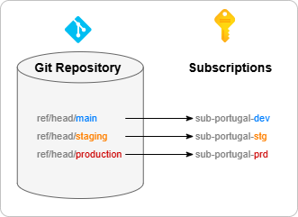
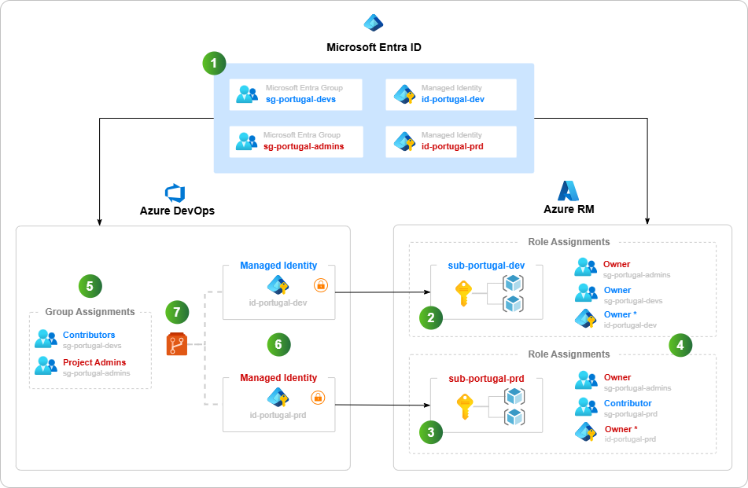
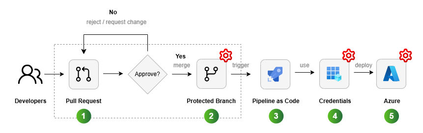

<!-- omit from toc -->
# az-devops-governance

[](https://github.com/msc365/az-devops-governance/releases) [](https://github.com/msc365/az-devops-governance/blob/main/LICENSE)

This repository demonstrates a complete **Azure governance model** using _Bicep templates_ and _PowerShell scripts_. It shows how to implement end-to-end governance from _Azure DevOps_ and CI/CD pipelines through to _Azure_ deployments, following enterprise-grade cloud architecture best practices.

While Terraform and Bicep excel at Azure infrastructure provisioning, they, _like the Azure DevOps REST API_, lack a cohesive approach for provisioning complete Azure DevOps projects with all necessary configurations. Simple tasks like creating a team require multiple sequential API calls to configure area paths, iteration paths, and group memberships separately. This repository solves these challenges with fully functional PowerShell scripts built on the [Azure.DevOps.PSModule](https://github.com/msc365/az-devops-psmodule), providing a streamlined, declarative approach to Azure DevOps resource management.

The implementation combines **Bicep templates** for Azure infrastructure and Microsoft Entra ID group management with **PowerShell scripts** for Azure DevOps automation. It adopts modern security practices including [workload identity federation](https://devblogs.microsoft.com/devops/workload-identity-federation-for-azure-deployments-is-now-generally-available/) for Azure Pipelines, replacing traditional service principals to improve security and manageability.

<!-- omit from toc -->
## Key features

- Practical guidance for implementing end-to-end governance at scale
- Template scripts and CI/CD pipelines for resource provisioning, and policy enforcement
- Secure authentication with workload identity federation

<!-- omit from toc -->
## What it does?

When designing a governance model, _Azure Resource Manager_ should be treated as one of several control planes for resources, not the only one. Azure DevOps and CI/CD automation can create unintended security gaps if they aren't properly secured, so pipeline and project artifacts must be protected by applying the same _Role‑based Access Control_ (RBAC) principles used for Azure Resource Manager.

End‑to‑end governance is platform‑agnostic. This repository illustrates one way to implement it using _Azure DevOps_, but the same patterns can be applied to alternative tools and platforms.

### Table of Contents

- [Use cases](#use-cases)
- [Architecture](#architecture)
- [Considerations](#considerations)
- [Components](#components)
- [Deploy this scenario](#deploy-this-scenario)
- [Support](#support)
- [License](#license)

## Use cases

> [!IMPORTANT]
> Please read this scenario carefully to understand the decisions behind the model used in this sample repository.

Any governance model must be tied to the organization's business rules, which are reflected in any technical implementation of access controls. This example model uses a fictitious international _Building Materials_ company with the following common scenario (with business requirements):

- **Align with business domains and permissions models**  
  The international organization has many Operational Companies (OpCo's), such as "_The portugal_" and "_netherlands_," which operate largely independently. In each OpCo, there are three levels or privileges, which are mapped to distinct `*-admins`, `*-devs` or `*-stake(holder)s` Microsoft Entra groups. This allows developers and stakeholders to be targeted when configuring permissions in the cloud.

- **Staged deployment environments**  
  Every business domain has two environments:
  - Production. Only admins have elevated privileges.
  - Non-production. All developers have elevated privileges (to encourage experimentation and innovation).
  
  Stakeholders are granted _Reader_ permissions across both production and non-production environments, providing visibility and oversight without the ability to modify resources. This ensures business owners and project managers can monitor deployments and resource status while maintaining security boundaries.

- **CI/CD automation goals**  
  Every application should implement Azure DevOps not just for _continuous integration_ (CI), but also for _continuous deployment_ (CD). For example, deployments can be automatically triggered by changes to the Git repository See [branch strategy diagram](#branch-strategy) sample.

- **Cloud journey**  
  The organization started with an isolated project model to accelerate the OpCo's journey to the cloud. But now they are exploring options to break silos and encourage collaboration by creating an `ccoe` project; Cloud Center of Excellence (CCoE).

### Branch strategy

This simplified diagram shows how branches in a Git repository map to development, staging, and production environments:

[](./.assets/e2egov-git-large.png)  
<sub>Image: Branch strategy diagram</sub>

## Architecture

> [!NOTE]
> This project is based on the concepts described in "[End-to-end governance in Azure when using CI/CD](https://learn.microsoft.com/en-us/devops/operate/governance-cicd)" by Julie Ng (Microsoft Corporation), which illustrates the approach using _Terraform_ as the infrastructure-as-code (IaC) tool.

This diagram illustrates that connecting Azure Resource Manager (ARM) and CI/CD to Microsoft Entra ID is crucial for establishing a comprehensive governance model.

[](./.assets/e2egov-design-large.png)  
<sub>Image: End-to-end governance diagram</sub>

> To make the concept easier to understand, the diagram only illustrates the `portugal` business domain. Other business domains would look similar and use the same naming conventions.

### Workflow
The numbering reflects the order in which administrators and enterprise architects think about and configure their cloud resources.

1. **Microsoft Entra ID**  
   You integrate _Azure DevOps_ with _Microsoft Entra ID_ in order to have a single plane for identity. This means a developer uses the same Microsoft Entra account for both Azure and Azure DevOps. Users are not added individually. Instead, membership is assigned by Microsoft Entra groups so that you can remove a developer's access to resources in a single step; by removing their Microsoft Entra group memberships.

   For each business domain, you create:

   - _Entra groups_  
     Two groups per business domain (explained later)

   - _Managed identities_  
     One explicit user managed identity per environment

2. **Development environment**  
   To simplify deployment, this demo implementation uses a _resource group_ to represent the production environment. In practice, you should use a different subscription.

3. **Production environment**  
   To simplify deployment, this demo implementation uses a _resource group_ to represent the production environment. In practice, you should use a different subscription.  

   Privileged access to this environment is limited to administrators only.

4. **Role assignments in Azure**  
   While these Entra group names suggest specific roles, access control is only enforced once a role assignment is set up. This process involves assigning a role to a Microsoft Entra principal within a defined scope. For instance, _Developers_ are granted the _Contributor_ role in the production environment.

   | Principal | Production | Development |
   | :-- | :-- | :-- |
   | `sg-portugal-stakes` | _Reader_ | _Reader_ |
   | `sg-portugal-devs` | _Contributor_ | _Owner_ |
   | `sg-portugal-admins` | _Owner_ | _Owner_ |
   | `id-portugal-dev` | - | _Custom Role_ * |
   | `id-portugal-prd` | _Custom Role_ * | - |

   > \* In real life scenarios you should create a _Custom Role_ that prevents a managed identity from removing any [management locks](https://learn.microsoft.com/en-us/azure/azure-resource-manager/management/lock-resources) that you've placed on your resources. This helps protect resources from accidental damage, such as database deletion. This can be easily done with the Bicep [avm/ptn/authorization/role-definition](https://github.com/Azure/bicep-registry-modules/tree/main/avm/ptn/authorization/role-definition) template from the [Azure Verified Modules](https://github.com/Azure/bicep-registry-modules) repo. An [example](iac/authorization/role-definition/main.bicep) is included in this demo project.

5. **Security group assignments in Azure DevOps**  
   Security groups function like roles in Azure. Take advantage of built-in roles and default to [Contributor](https://learn.microsoft.com/en-us/azure/devops/user-guide/roles#contributor-roles) for developers. Admins get assigned to the [Project Administrator](https://learn.microsoft.com/en-us/azure/devops/user-guide/roles#project-administrators) security group for elevated permissions, allowing them to configure security permissions.

   Note that Azure DevOps and Azure have different permissions models:
   - Azure uses an [additive permissions](https://learn.microsoft.com/en-us/azure/role-based-access-control/overview#multiple-role-assignments) model.
   - Azure DevOps uses a [least permissions](https://learn.microsoft.com/en-us/azure/devops/organizations/security/about-permissions?tabs=preview-page) model.

   For this reason, membership to the `*-admins`, `*-devs` and `*-stakes` groups must be mutually exclusive. Otherwise, the affected persons would have less access than expected in Azure DevOps.

   | Group name | Scope | Azure role | Azure DevOps role |
   | :-- | :-- | :-- | :-- |
   | `sg-portugal-collab-on-repo-a` ¹ | - | - | Repo-scoped permissions only |
   | `sg-portugal-stakes` | `rg-portugal-prd` | Reader | Reader |
   | `sg-portugal-devs` | `rg-portugal-dev` | Contributor | Contributor |
   | `sg-portugal-admins` | `rg-portugal-prd` | Owner | Project Administrators |
   | `sg-netherlands-stakes` | `rg-portugal-prd` | Reader | Reader |
   | `sg-netherlands-devs` | `rg-netherlands-dev` | Contributor | Contributor |
   | `sg-netherlands-admins` | `rg-netherlands-prd` | Owner | Project Administrators |
   | `sg-shared-devs` | `rg-shared-dev` | Contributor | Contributor |
   | `sg-shared-admins` | `rg-shared-prd` | Owner | Project Administrators |

   ¹ In a scenario of limited cross‑project collaboration, such as the `portugal` team inviting the `netherlands` team to collaborate on a _single_ repository, they would use a specific `*-portugal-collab-on-repo-a` group with limited repo-scoped permissions only, all other content remains invisible. Please read [A Cross-project Collaboration Scenario](docs/cross-project-collaboration-scenario.md) for more details.

6. **Service connections**  
   In Azure DevOps, a [Service Connection](https://learn.microsoft.com/en-us/azure/devops/pipelines/library/service-endpoints) is a generic wrapper around a credential. This demo creates a service connection that holds the [App Registration](https://learn.microsoft.com/en-us/azure/devops/pipelines/release/configure-workload-identity?view=azure-devops&tabs=app-registration) and [Workload Identity Federation](https://learn.microsoft.com/en-us/azure/devops/pipelines/release/configure-workload-identity?view=azure-devops&tabs=managed-identity) configuration. Project Administrators can configure access to this [protected resource](https://learn.microsoft.com/en-us/azure/devops/pipelines/security/resources#protected-resources) when needed, such as when requiring human approval before deploying. This reference architecture has two minimum protections on the service connection:

   - Admins must configure [pipeline permissions](https://learn.microsoft.com/en-us/azure/devops/pipelines/security/resources#permissions) to control which pipelines can access the credentials.
   - Admins must also configure a [branch control](https://learn.microsoft.com/en-us/azure/devops/pipelines/process/approvals#branch-control) check so that only pipelines running in the context of the `production` branch might use the `prod-connection`.

7. **Git repositories**  
   Because service connections are tied to branches via [branch controls](https://learn.microsoft.com/en-us/azure/devops/pipelines/process/approvals#branch-control), it's critical to configure permissions to the Git repositories and apply [branch policies](https://learn.microsoft.com/en-us/azure/devops/repos/git/branch-policies). In addition to requiring CI builds to pass, we also require pull requests to have at least two approvers.

## Considerations

To achieve end-to-end governance in Azure, it's important to understand the security and permissions profile of the path from developer's computer to production. The following diagram illustrates a baseline CI/CD workflow with Azure DevOps. The red configuration  icon indicates security permissions that must be configured by the user. Not configuring or misconfigured permissions will leave your workloads vulnerable.

To successfully secure your workloads, you must use a combination of security permission configurations and human checks in your workflow. It's important that any RBAC model must also extend to both pipelines and code. These often run with privileged identities and will destroy your workloads if instructed to do so. To prevent this from happening, you should configure [branch policies](https://learn.microsoft.com/en-us/azure/devops/repos/git/branch-policies) on your repository to require human approval before accepting changes that trigger automation pipelines.

[](.assets/e2egov-workflow-large.png)  
<sub>Image: Baseline CI/CD workflow</sub>

<!-- omit from toc -->
## Baseline CI/CD workflow breakdown

| No <br><br> | Development stages | Responsibility <br><br> | Description <br><br> |
| :-- | :-- | :-- | :-- |
|  | Pull Requests | User | Engineers should peer review their work, including the Pipeline code itself. |
|  | Branch Protection | Shared | Configure [Azure DevOps](https://learn.microsoft.com/en-us/azure/devops/repos/git/branch-policies) to reject changes that do not meet certain standards, such as CI checks and peer reviews (via pull requests). |
|  | Pipeline as Code | User  | A build server will delete your entire production environment if the pipeline code instructs it to do so. Help prevent this by using a combination of pull requests and branch protection rules, such as human approval. |
|  | Service Connections | Shared | Configure Azure DevOps to restrict access to these credentials. |
|  | Azure Resources | Shared | Configure RBAC in Resource Manager. |

The following concepts and questions are important to consider when designing a governance model. Bear in mind the [potential use cases](#use-cases) of the demo organization.

### Safeguard your environments with branch policies

 

Because your source code defines and triggers deployments, your first line of defense is to secure your source code management (SCM) repository. In practice, this is achieved by using the [pull request workflow](https://learn.microsoft.com/en-us/azure/devops/repos/git/about-pull-requests) in combination with [branch policies](https://learn.microsoft.com/en-us/azure/devops/repos/git/branch-policies), which define checks and requirements before code can be accepted.

When planning your end-to-end governance model, privileged users (`*-admins`) will be responsible for configuring branch protection. Common branch protection checks used to secure your deployments include:

- **Require CI build to pass**  
  Useful for establishing baseline code quality, such as code linting, unit tests, and even security checks like virus and credential scans.

- **Require peer review**  
  Have another human double check that code works as intended. Be extra careful when changes are made to pipeline code. Combine with CI builds to make peer reviews less tedious.

#### What happens if a developer tries to push directly to production?

Remember that Git is a distributed SCM system. A developer can commit directly to their local production branch. But when Git is properly configured, such a push will be automatically rejected by the Git server. For example:

#### PowerShell

```cmd
remote: Resolving deltas: 100% (3/3), completed with 3 local objects.
remote: error: GH006: Protected branch update failed for refs/heads/main.
remote: error: Required status check "continuous-integration" is expected.
To https://github.com/msc365/az-devops-governance
 ! [remote rejected] main -> main (protected branch hook declined)
error: failed to push some refs to 'https://github.com/msc365/az-devops-governance'
```

Note that the workflow in the example is vendor agnostic. The pull request and branch protection features are available from multiple SCM providers, including [Azure Repos](https://azure.microsoft.com/services/devops/repos), [GitHub](https://github.com/), and [GitLab](https://gitlab.com/).

Once the code has been accepted into a protected branch, the next layer of access controls will be applied by the build server (such as [Azure Pipelines](https://azure.microsoft.com/products/devops/pipelines/)).

### What access do security principals need?


In Azure, a [security principal](https://learn.microsoft.com/en-us/azure/role-based-access-control/overview#security-principal) can be either a _user principal_ or a _headless principal_, such as a service principal or managed identity. In all environments, security principals should follow the [principle of least privilege](https://learn.microsoft.com/en-us/azure/role-based-access-control/best-practices#only-grant-the-access-users-need). While security principals might have expanded access in pre-production environments, production Azure environments should minimize standing permissions, favoring just-in-time (JIT) access and Microsoft Entra Conditional Access. Craft your Azure RBAC role assignments for user principals to align with these least privilege principals.

It's also important to model Azure RBAC distinctly from Azure DevOps RBAC. The purpose of the pipeline is to minimize direct access to Azure. Except for special cases like innovation, learning, and issue resolution, most interactions with Azure should be conducted through purpose-built and gated pipelines.

For Azure Pipeline service principals, consider using a [custom role](https://learn.microsoft.com/en-us/azure/role-based-access-control/custom-roles) that prevents it from removing resource locks and performing other destructive actions out of scope for its purpose.

### Create a custom role for the service principal


It's a common mistake to give CI/CD build agents Owner roles and permissions. Contributor permissions are not enough if your pipeline also needs to perform identity role assignments or other privileged operations like Key Vault policy management.

But a CI/CD Build Agent will delete your entire production environment if told to do so. To avoid **irreversible destructive changes**, we create a custom role that:

- Removes Key Vault access policies
- Removes [management locks](https://learn.microsoft.com/en-us/azure/azure-resource-manager/management/lock-resources) that by design should prevent resources from being deleted (a common requirement in regulated industries)

To do this, we create a custom role and remove the `Microsoft.Authorization/*/Delete` actions.

```json
{
  "Name": "Headless Owner",
  "Description": "Can manage infrastructure.",
  "actions": [
    "*"
  ],
  "notActions": [
    "Microsoft.Authorization/*/Delete"
  ],
  "AssignableScopes": [
    "/subscriptions/{subscriptionId1}",
    "/subscriptions/{subscriptionId2}",
    "/providers/Microsoft.Management/managementGroups/{groupId1}"
  ]
}
```

If that removes too many permissions for your purposes, refer to the full list in the [official documentation for Azure RBAC resource provider operations](https://learn.microsoft.com/en-us/azure/role-based-access-control/resource-provider-operations) and adjust your role definition as needed.

## Components

- [Azure DevOps](https://azure.microsoft.com/en-us/products/devops/)
- [Microsoft Entra ID](https://learn.microsoft.com/en-us/entra/)
- [Azure Resource Manager](https://learn.microsoft.com/en-us/azure)
- [Azure Repos](https://azure.microsoft.com/en-us/products/devops/repos/)
- [Azure Pipelines](https://azure.microsoft.com/en-us/products/devops/pipelines/)

## Deploy this scenario

This scenario extends beyond Azure Resource Manager. This is way we use **Bicep templates** for Azure infrastructure provisioning and Microsoft Entra ID group management, and **PowerShell scripts** for Azure DevOps bootstrapping. This combination provides declarative infrastructure-as-code for Azure resources and identity while leveraging PowerShell's flexibility for DevOps operations in a declarative DSC like approach.

For deployment examples and instructions, explore the template files in the [iac](iac/) and [src](src/) directories. Also take notice of the [Understanding this demo](docs/understanding-this-demo.md) documentation for more details.

## Support

This project uses GitHub Issues to track bugs and feature requests.
Please [search the existing issues](https://github.com/msc365/az-devops-governance/issues?q=is%3Aissue) before filing
new issues to avoid duplicates.

- For new issues, file your bug or feature request as a [new issue](https://github.com/msc365/az-devops-governance/issues/new/choose).
- For help and questions, please raise an issue or start a [new discussion](https://github.com/msc365/az-devops-governance/discussions).

## License

  
Part of Martin's Cloud on GitHub

Copyright (c) 2026 MSc365.eu by Martin Swinkels

Portions of the documentation in this repository are adapted from Microsoft Corporation's
documentation and the article "End-to-end governance in Azure when using CI/CD" by Julie Ng
(Microsoft Corporation), used under the MIT License.

This project is published under the MIT license.  
See [MIT License](LICENSE) for details.

<!-- omit from toc -->
## Disclaimer

This repository is provided "**as is**" and is subject to **limited support**. While reasonable efforts
have been made to ensure its usefulness, there are **no warranties or guarantees** regarding accuracy,
reliability, security, or ongoing maintenance. By using this code, you acknowledge and agree that you
do so at your own risk. It is your responsibility to validate, test, and ensure suitability for your specific
use case, particularly in production environments. We welcome community contributions and feedback to improve
the project; however, official support will limited.

<!-- omit from toc -->
## Liability

Under no circumstances shall the authors, contributors, or affiliated organizations be held liable for
any direct, indirect, incidental, or consequential damages arising from the use of this repository, including
but not limited to loss of data, business interruption, or system failures.
Use of this code implies acceptance of these terms.

<!-- omit from toc -->
## Trademarks

This project may contain trademarks or logos for projects, products, or services. Authorized use of Microsoft
trademarks or logos is subject to and must follow
[Microsoft's Trademark & Brand Guidelines](https://www.microsoft.com/legal/intellectualproperty/trademarks/usage/general).
Use of Microsoft trademarks or logos in modified versions of this project must not cause confusion or imply Microsoft
sponsorship. Any use of third-party trademarks or logos are subject to those third-party's policies.
