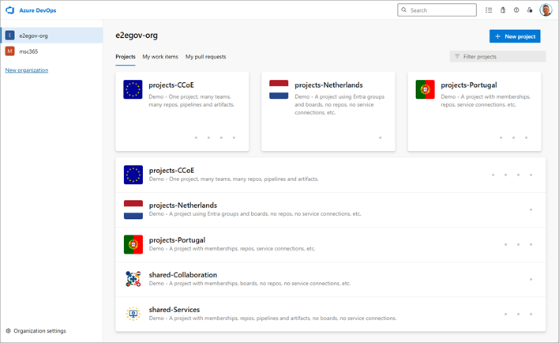
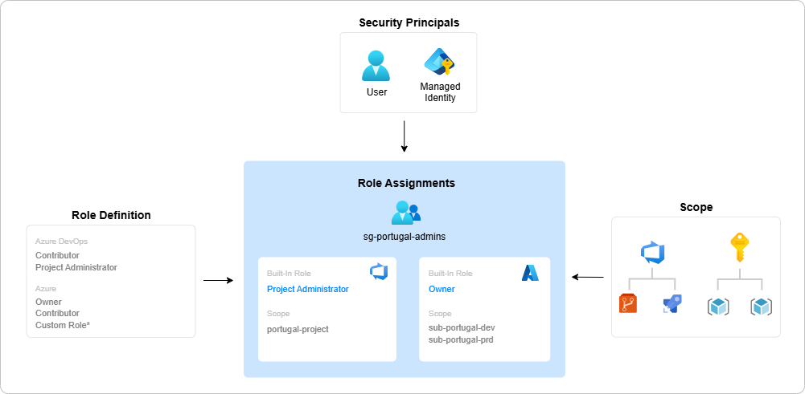

<!-- omit from toc -->
# az-devops-governance

This repository includes template scripts that demonstrate a complete Azure governance model. The template examples showcase how to implement end-to-end governance from Azure DevOps and CI/CD pipelines to Azure Resource Manager deployments, aligning with best practices for enterprise-grade cloud architecture.

> [!NOTE]
> This project is based on the concepts described in [End-to-end governance in Azure when using CI/CD](https://learn.microsoft.com/en-us/devops/operate/governance-cicd) (Julie Ng, Microsoft), which illustrates the approach using Terraform as the infrastructure-as-code (IaC) tool. As an alternative, this repository uses Bicep for IaC where applicable and provides template scripts built on the [Azure.DevOps.PSModule](https://github.com/msc365/az-devops-psmodule). The repository also adopts modern best practices by using [workload identity federation](https://devblogs.microsoft.com/devops/workload-identity-federation-for-azure-deployments-is-now-generally-available/) for Azure Pipelines instead of traditional service principals, improving both security and manageability.

<!-- omit from toc -->
## Key features

- Practical guidance for implementing end-to-end governance at scale
- Template scripts and CI/CD pipelines for resource provisioning, and policy enforcement
- Secure authentication with workload identity federation

<!-- omit from toc -->
<!-- ## Use Cases

- Automate DevOps workflows and resource deployments
- Enforce governance policies across environments
- Integrate Azure DevOps with PowerShell and infrastructure-as-code practices
- Accelerate onboarding and standardization for cloud teams -->

<!-- omit from toc -->
<!-- ## 🚧 Under construction

The following features are being considered or under construction.

- Use app-only authentication with the `Microsoft Graph PowerShell SDK`. -->

<!-- omit from toc -->
## What it does?

When designing a governance model, Azure Resource Manager should be treated as one of several control planes for resources, not the only one. Azure DevOps and CI/CD automation can create unintended security gaps if they aren't properly secured, so pipeline and project artifacts must be protected by applying the same role‑based access control (RBAC) principles used for Azure Resource Manager.

End‑to‑end governance is platform‑agnostic. This repository illustrates one way to implement it using Azure DevOps, but the same patterns can be applied to alternative tools and platforms.

### Table of Contents

- [Use cases](#use-cases)
- [Branch strategy](#branch-strategy)
- [Architecture](#architecture)
- [Azure resources](#azure-resources)
- [Azure DevOps Projects](#azure-devops-projects)
- [Entra ID Groups](#entra-id-groups)
- [Components](#components)
- [Considerations](#considerations)


## Use cases

🚧 Todo → Description

- Align with business domains and permissions models
- Staged deployment environments
- CI/CD automation goals
- Cloud journey

## Branch strategy

This simplified diagram shows how branches in a Git repository map to development, staging, and production environments:

  
<sub>Image: Branch strategy diagram</sub>

🚧 Todo → Description

## Architecture

This diagram illustrates that connecting Azure Resource Manager (ARM) and CI/CD to Microsoft Entra ID is crucial for establishing a comprehensive governance model.

  
<sub>Image: End-to-end governance diagram</sub>

> [!NOTE]  
> To make the concept easier to understand, the diagram illustrates a general `e2egov` business domain. Other business domains would look similar and use the same naming conventions, for example: `e2egov-avengers-devs`.

The numbering reflects the order in which administrators and enterprise architects think about and configure their cloud resources.

1. **Microsoft Entra ID**  
   You integrate _Azure DevOps_ with _Microsoft Entra ID_ in order to have a single plane for identity. This means a developer uses the same Microsoft Entra account for both Azure and Azure DevOps. Users are not added individually. Instead, membership is assigned by Microsoft Entra groups so that you can remove a developer's access to resources in a single step; by removing their Microsoft Entra group memberships.

   For each business domain, you create:

   - _Entra groups_  
     Two groups per business domain (explained later)

   - _Managed identities_  
     One explicit user managed identity per environment

2. **Development environment**  
   To simplify deployment, this demo implementation uses a _resource group_ to represent the production environment. In practice, you should use a different subscription.

3. **Production environment**  
   To simplify deployment, this demo implementation uses a _resource group_ to represent the production environment. In practice, you should use a different subscription.  

   Privileged access to this environment is limited to administrators only.

4. **Role assignments in Azure**  
   While these Entra group names suggest specific roles, access control is only enforced once a role assignment is set up. This process involves assigning a role to a Microsoft Entra principal within a defined scope. For instance, _Developers_ are granted the _Reader_ role in the production environment.

   | Principal | Production | Development |
   | :-- | :-- | :-- |
   | `sg-e2egov-devs` | _Reader_ | _Owner_ |
   | `sg-e2egov-admins` | _Owner_ | _Owner_ |
   | `id-e2egov-dev` | - | _Custom Role_ * |
   | `id-e2egov-prd` | _Custom Role_ * | - |

> [!WARNING]  
> In production you should create a _Custom Role_ that prevents a managed identity from removing any [management locks](https://learn.microsoft.com/en-us/azure/azure-resource-manager/management/lock-resources) that you've placed on your resources. This helps protect resources from accidental damage, such as database deletion. This can be easily done with the Bicep [avm/ptn/authorization/role-definition](https://github.com/Azure/bicep-registry-modules/tree/main/avm/ptn/authorization/role-definition) template from the [Azure Verified Modules](https://github.com/Azure/bicep-registry-modules) repo. An [example](iac/authorization/role-definition/main.bicep) is included in this demo project.

1. **Group assignments in Azure DevOps**  
   Security groups function like roles in Azure. Take advantage of built-in roles and default to [Contributor](https://learn.microsoft.com/en-us/azure/devops/user-guide/roles#contributor-roles) for developers. Admins get assigned to the [Project Administrator](https://learn.microsoft.com/en-us/azure/devops/user-guide/roles#project-administrators) security group for elevated permissions, allowing them to configure security permissions.

   Note that Azure DevOps and Azure have different permissions models:
   - Azure uses an [additive permissions](https://learn.microsoft.com/en-us/azure/role-based-access-control/overview#multiple-role-assignments) model.
   - Azure DevOps uses a [least permissions](https://learn.microsoft.com/en-us/azure/devops/organizations/security/about-permissions?tabs=preview-page) model.

   For this reason, membership to the `*-admins` and `*-devs` groups must be mutually exclusive. Otherwise, the affected persons would have less access than expected in Azure DevOps. To address this conceptual problem the `*-all` groups could be used. See the [Entra ID Groups](#entra-id-groups) section for more details.

2. **Service connections**  
   In Azure DevOps, a [Service Connection](https://learn.microsoft.com/en-us/azure/devops/pipelines/library/service-endpoints) is a generic wrapper around a credential. This demo creates a service connection that holds the [App Registration](https://learn.microsoft.com/en-us/azure/devops/pipelines/release/configure-workload-identity?view=azure-devops&tabs=app-registration) and [Workload Identity Federation](https://learn.microsoft.com/en-us/azure/devops/pipelines/release/configure-workload-identity?view=azure-devops&tabs=managed-identity) configuration. Project Administrators can configure access to this [protected resource](https://learn.microsoft.com/en-us/azure/devops/pipelines/security/resources#protected-resources) when needed, such as when requiring human approval before deploying. This reference architecture has two minimum protections on the service connection:

   - Admins must configure [pipeline permissions](https://learn.microsoft.com/en-us/azure/devops/pipelines/security/resources#permissions) to control which pipelines can access the credentials.
   - Admins must also configure a [branch control](https://learn.microsoft.com/en-us/azure/devops/pipelines/process/approvals#branch-control) check so that only pipelines running in the context of the `production` branch might use the `prod-connection`.


7. **Git repositories**  
   Because service connections are tied to branches via [branch controls](https://learn.microsoft.com/en-us/azure/devops/pipelines/process/approvals#branch-control), it's critical to configure permissions to the Git repositories and apply [branch policies](https://learn.microsoft.com/en-us/azure/devops/repos/git/branch-policies). In addition to requiring CI builds to pass, we also require pull requests to have at least two approvers.

## Azure resources

To simplify the demo deployment, this reference implementation uses _Resource Groups_ to represent the `environments`. In practice, you should use different _Subscriptions_.

- `rg-e2egov-avengers-dev`
- `rg-e2egov-avengers-prd`
- `rg-e2egov-guardians-dev`
- `rg-e2egov-guardians-prd`
- `rg-e2egov-galaxy-shared`

## Azure DevOps Projects

The project demo structure illustrates different governance models and their trade-offs.

  
<sub>Image: Azure DevOps organization created with scripts form this repo</sub>

- The isolated model with the `avengers` and `guardians` projects means less governance management - at the cost of less collaboration.
- The `fantastic-four` project prioritizes collaboration via multiple shared Azure Boards - but requires more governance management, especially for repositories and pipelines.

| Project | Boards | Repos | Pipelines | Description |
| :-- | :-- | :-- | :-- | :-- |
| `avengers` |  Yes | Yes | Yes | Isolated by project scope |
| `guardians` | Yes | Yes | Yes | Isolated by project scope |
| `galaxy` | No | Yes | Yes | Shared resources |
| `fantastic-four` | Yes | Yes | Yes | One project multiple teams, prioritizes collaboration |

## Entra ID Groups

The key to en-to-end governance is to have multiple role assignments (with different role definitions and different resource scopes to the same Entra ID Groups).

  
<sub>Image: Role Assignment diagram</sub>

### Isolated governance model

| Group name | Scope | Azure role | Azure DevOps role |
|:--|:--|:--|:--|
| `sg-e2egov-avengers-all` ¹ | - | - | - |
| `sg-e2egov-avengers-devs` | `rg-e2egov-avengers-dev` | Contributor | Contributor |
| `sg-e2egov-avengers-admins` | `rg-e2egov-avengers-prd` | Owner | Project Administrators |
| `sg-e2egov-guardians-all` | - | - | - |
| `sg-e2egov-guardians-devs` | `rg-e2egov-guardians-dev` | Contributor | Contributor |
| `sg-e2egov-guardians-admins` | `rg-e2egov-guardians-prd` | Owner | Project Administrators |
| `sg-e2egov-galaxy-all` | - | - | - |
| `sg-e2egov-galaxy-devs` | `rg-e2egov-galaxy-dev` | Contributor | Contributor |
| `sg-e2egov-galaxy-admins` | `rg-e2egov-galaxy-prd` | Owner | Project Administrators |

¹ In a scenario of limited collaboration, such as the `avengers` team inviting the `guardians` team to collaborate on a _single_ repository, they would use the `*-avenger-all` group.

### Collaboration governance model

| Group name | Scope | Azure role | Azure DevOps role |
|:--|:--|:--|:--|
| `sg-e2egov-fantastic-four-all` | - | - | - |
| `sg-e2egov-fantastic-four-devs` | `rg-e2egov-fantastic-four-dev` | Contributor | Contributor |
| `sg-e2egov-fantastic-four-admins` | `rg-e2egov-fantastic-four-prd` | Owner | Project Administrators |

To understand the reasoning behind the individual role assignments, refer to the [Considerations](#considerations) section.

## Components

- [Azure DevOps](https://azure.microsoft.com/en-us/products/devops/)
- [Microsoft Entra ID](https://learn.microsoft.com/en-us/entra/)
- [Azure Resource Manager](https://learn.microsoft.com/en-us/azure)
- [Azure Repos](https://azure.microsoft.com/en-us/products/devops/repos/)
- [Azure Pipelines](https://azure.microsoft.com/en-us/products/devops/pipelines/)

## Considerations

To achieve end-to-end governance in Azure, it's important to understand the security and permissions profile of the path from developer's computer to production. The following diagram illustrates a baseline CI/CD workflow with Azure DevOps. The red configuration  icon indicates security permissions that must be configured by the user. Not configuring or misconfigured permissions will leave your workloads vulnerable.

To successfully secure your workloads, you must use a combination of security permission configurations and human checks in your workflow. It's important that any RBAC model must also extend to both pipelines and code. These often run with privileged identities and will destroy your workloads if instructed to do so. To prevent this from happening, you should configure [branch policies](https://learn.microsoft.com/en-us/azure/devops/repos/git/branch-policies) on your repository to require human approval before accepting changes that trigger automation pipelines.

  
<sub>Image: Baseline CI/CD workflow</sub>

<!-- omit from toc -->
## Baseline CI/CD workflow breakdown

| No <br><br> | Development stages | Responsibility <br><br> | Description <br><br> |
| :-- | :-- | :-- | :-- |
|  | Pull Requests | User | Engineers should peer review their work, including the Pipeline code itself. |
|  | Branch Protection | Shared | Configure [Azure DevOps](https://learn.microsoft.com/en-us/azure/devops/repos/git/branch-policies) to reject changes that do not meet certain standards, such as CI checks and peer reviews (via pull requests). |
|  | Pipeline as Code | User  | A build server will delete your entire production environment if the pipeline code instructs it to do so. Help prevent this by using a combination of pull requests and branch protection rules, such as human approval. |
|  | Service Connections | Shared | Configure Azure DevOps to restrict access to these credentials. |
|  | Azure Resources | Shared | Configure RBAC in Resource Manager. |

The following concepts and questions are important to consider when designing a governance model. Bear in mind the [potential use cases](#use-cases) of the demo organization.

### Safeguard your environments with branch policies

 

Because your source code defines and triggers deployments, your first line of defense is to secure your source code management (SCM) repository. In practice, this is achieved by using the [pull request workflow](https://learn.microsoft.com/en-us/azure/devops/repos/git/about-pull-requests) in combination with [branch policies](https://learn.microsoft.com/en-us/azure/devops/repos/git/branch-policies), which define checks and requirements before code can be accepted.

When planning your end-to-end governance model, privileged users (`*-admins`) will be responsible for configuring branch protection. Common branch protection checks used to secure your deployments include:

- **Require CI build to pass**  
  Useful for establishing baseline code quality, such as code linting, unit tests, and even security checks like virus and credential scans.

- **Require peer review**  
  Have another human double check that code works as intended. Be extra careful when changes are made to pipeline code. Combine with CI builds to make peer reviews less tedious.

#### What happens if a developer tries to push directly to production?

Remember that Git is a distributed SCM system. A developer can commit directly to their local production branch. But when Git is properly configured, such a push will be automatically rejected by the Git server. For example:

#### PowerShell

```cmd
remote: Resolving deltas: 100% (3/3), completed with 3 local objects.
remote: error: GH006: Protected branch update failed for refs/heads/main.
remote: error: Required status check "continuous-integration" is expected.
To https://github.com/msc365/az-devops-governance
 ! [remote rejected] main -> main (protected branch hook declined)
error: failed to push some refs to 'https://github.com/msc365/az-devops-governance'
```

Note that the workflow in the example is vendor agnostic. The pull request and branch protection features are available from multiple SCM providers, including [Azure Repos](https://azure.microsoft.com/services/devops/repos), [GitHub](https://github.com/), and [GitLab](https://gitlab.com/).

Once the code has been accepted into a protected branch, the next layer of access controls will be applied by the build server (such as [Azure Pipelines](https://azure.microsoft.com/products/devops/pipelines/)).

### What access do security principals need?


🚧 Todo → Description

### Create a custom role for the service principal


🚧 Todo → Description

<!-- omit from toc -->
## License

  
<sub>Part of Martin's Cloud on GitHub</sub>

[MIT License](LICENSE) | Copyright (c) 2025 MSc365.eu by Martin Swinkels

<!-- omit from toc -->
## Disclaimer

Sample only – this is not an official supported repository. Use at your own risk.
