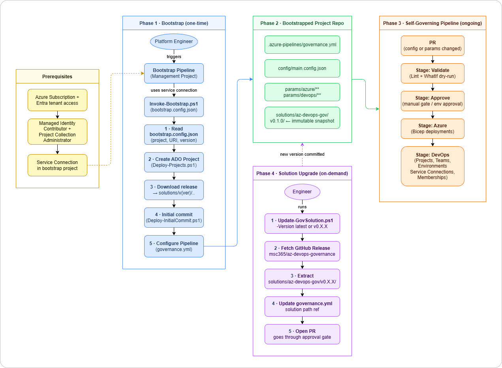

# Azure DevOps Self‑Governing Project Bootstrap

A one-time bootstrap execution seeds a brand-new Azure DevOps project with versioned solution files from this repo. From that point, the project governs itself: developers change config files, raise a PR, and the in-project governance pipeline enforces the desired state. New releases of the solution can be pulled in independently using an upgrade script, making the version boundary explicit and safe.

## Architecture Diagram

  
<sub>Image: Architecture diagram</sub>

## Phases

### Phase 1. Bootstrap (one-time, run by a platform engineer)

**Prerequisites** (must be in place before bootstrap runs):

- An Azure Subscription and Entra tenant with sufficient access
- A **Managed Identity** granted *Project Collection Administrator* in Azure DevOps and *Contributor* on the target subscription
- A **Service Connection** in a management/bootstrap project that uses the managed identity above

> When running via an Azure Pipeline, the pipeline uses this service connection so no individual engineer needs Project Collection Administrator rights. When running locally, the engineer must hold those permissions themselves.

**Trigger:** A platform engineer triggers `Invoke-Bootstrap.ps1` via a **bootstrap pipeline in a management project** (recommended), using the managed identity and service connection defined in the prerequisites. Running locally is possible but requires the engineer to hold Project Collection Administrator rights personally.

**Steps:**

1. Read `bootstrap.config.json` (project name, org URI, solution version, solution source path)
2. Call `Deploy-Projects.ps1` to create the new Azure DevOps project
3. Download the release archive for the specified solution version from `msc365/az-devops-governance` and extract it into `solutions/az-devops-governance/v{version}/`, then bundle project-specific files: `config/main.config.json`, `params/`, `.azure-pipelines/governance.yml`
4. Call `Deploy-InitialCommit.ps1` to push all files to the default repo in a single commit
5. Create the Azure Pipeline definition pointing at `.azure-pipelines/governance.yml` in the new repo

### Phase 2. Bootstrapped Project Repository Layout

```text
<new-project-default-repo>/
├── .azure-pipelines/
│   └── governance.yml              ← pipeline definition
├── config/
│   └── main.config.json            ← project-level configuration (editable by devs)
├── params/
│   ├── azure/  ...                 ← Bicep parameter files
│   └── devops/ ...                 ← DevOps parameter files
└── solutions/
    └── az-devops-governance/
        └── v0.1.0/                 ← versioned, immutable snapshot of this repo
            ├── src/
            ├── iac/
            ├── schemas/
            └── scripts/
                └── Update-GovernanceSolution.ps1
```

</br>

### Phase 3. Self-Governing Pipeline (ongoing)

**Trigger:** Any push to a PR branch affecting `config/**` or `params/**`.

**Pipeline stages (in `governance.yml`):**

| Stage | What it does |
| --- | --- |
| Validate | Lint configs/params, `WhatIf` dry-run |
| Approve | Manual approval gate (environment approval) |
| Azure | Deploy Bicep (resource groups, managed identities, security groups, role assignments) |
| DevOps | Deploy project settings, teams, environments, service connections, memberships |

Approvals and environment checks are configured during the first scaffold run, so from the second run onwards, governance changes require review and explicit approval.

### Phase 4. Solution Upgrade (on-demand)

A developer or platform engineer runs `Update-GovernanceSolution.ps1`, which:

1. Queries the GitHub Releases API for the latest (or specified) release of `msc365/az-devops-governance`
2. Downloads and extracts the release archive
3. Copies files into `solutions/az-devops-governance/v{new-version}/`
4. Updates the `governance.yml` solution path reference to the new version
5. Opens a PR — so the upgrade itself goes through the approval gate

## Key Design Decisions

| Decision | Rationale |
| --- | --- |
| **Versioned solution subfolder** (`solutions/az-devops-governance/v{ver}/`) | The solution files are immutable per version. Multiple versions can coexist, making rollback trivial and the upgrade path explicit. |
| **`governance.yml` references solution by version path** | A single variable (e.g., `solutionVersion: v0.1.0`) in the pipeline file controls which version is active. Upgrading means updating that one variable. |
| **Bootstrap uses existing script patterns** | `Deploy-Projects.ps1`, `Deploy-InitialCommit.ps1` and related already exist. `Invoke-Bootstrap.ps1` is an orchestrator on top. No new paradigms, just a higher-level entrypoint. |
| **Azure prerequisites bootstrapped once, then managed by pipeline** | The managed identity and service connection are created by the bootstrap script. Subsequent pipeline runs use them and can update them as governed resources. |
| **Upgrade goes through a PR** | `Update-GovernanceSolution.ps1` never auto-merges. The version bump is a first-class change, subject to the same approval gates as any other governance change; intentional and auditable. |
| **Pipeline approval gates are scaffold outputs** | Approvals (environment checks) are deployed as part of the governance scaffold itself, so they are code-defined and reproducible, not manual portal configuration. |


## New Artifacts to Build

| Artifact | Description |
| --- | --- |
| `scripts/Invoke-Bootstrap.ps1` | Orchestrator: reads config, calls existing deploy scripts in sequence, then creates the pipeline definition |
| `bootstrap/bootstrap.config.json` | Schema-backed config describing the new project, source version, and solution target path |
| `.azure-pipelines/governance.yml` | Template pipeline committed into the new repo; references `solutions/az-devops-governance/{solutionVersion}/` |
| `scripts/Update-GovernanceSolution.ps1` | Fetches a GitHub release, extracts it into the versioned subfolder, updates the pipeline version reference, optionally creates a branch/PR |
