<!-- markdownlint-disable MD024 -->
<!-- omit from toc -->
# Azure DevOps Self‑Governing Project Bootstrap

This architecture proposal describes a _one-time bootstrap execution_ that seeds a brand-new Azure DevOps project with versioned solution files from this repo. From that point, _the project governs itself_: developers change config files, raise a PR, and the in-project governance pipeline enforces the desired state. New releases of the solution can be pulled in independently using an upgrade script, making the version boundary explicit and safe.

<!-- omit from toc -->
## Architecture Diagram



<sub>Image: Bootstrap Overview Diagram</sub>

<!-- omit from toc -->
## Phases
- [Phase 1. Platform Engineer](#phase-1-platform-engineer)
- [Phase 2. Bootstrap Solution](#phase-2-bootstrap-solution)
- [Phase 3. Base Project](#phase-3-base-project)
- [Phase 4. Project Configurations](#phase-4-project-configurations)
- [Phase 5. Self-Governed Project](#phase-5-self-governed-project)
- [Phase 6. Upgrade Solution (Optional)](#phase-6-upgrade-solution-optional)
- [Key Design Decisions](#key-design-decisions)
- [New Artifacts to Build](#new-artifacts-to-build)

<!-- toc -->
## Phase 1. Platform Engineer

### Prerequisites

Must be in place before bootstrap runs:

- An Azure Subscription and Entra tenant with sufficient access

The following are provisioned automatically by running `Invoke-Prerequisites.ps1` once:

- A **bootstrap management project** in Azure DevOps (optional: `Invoke-Prerequisites.ps1` can create this project or target an existing one via a parameter)
- A **Managed Identity** granted _Project Collection Administrator_ in Azure DevOps and _Contributor_ on the target Azure Subscription
- A **Service Connection** in the bootstrap management project that uses the managed identity above

> [!NOTE]
> Once provisioned, the pipeline uses this service connection so no individual engineer needs _Project Collection Administrator_ in Azure DevOps or _Contributor_ on the target Azure Subscription. When running locally without first running `Invoke-Prerequisites.ps1`, the engineer must hold those permissions themselves.

> [!TIP]
> `Invoke-Prerequisites.ps1` can be run locally when a pipeline-based setup is not yet available or not preferred. It supports `-WhatIf` and `-Confirm` so the engineer can preview or step through each action.

### Trigger

For each new project, a platform engineer adds a `bootstrap/projects/{prefix}.bootstrap.config.json` file and triggers the `bootstrap.yml` pipeline manually in the _bootstrap management project_, setting the `ConfigPath` parameter to the new config file (recommended), or runs `Invoke-Bootstrap.ps1 -ConfigPath bootstrap/projects/{prefix}.bootstrap.config.json` locally.

Multiple projects can be bootstrapped independently by adding config files side by side under `bootstrap/projects/`.

> [!NOTE]
> It is recommended that changes to `bootstrap/projects/*.bootstrap.config.json` go through a pull request in the management project repo before triggering bootstrap. This ensures that new project creation is reviewed and auditable. This requires the management project repo to have a branch policy configured, which `Invoke-Prerequisites.ps1` can set up optionally.

## Phase 2. Bootstrap Solution

### Script Stages

| Stage | What it does |
| --- | --- |
| Config | Resolve the triggering `bootstrap/projects/{prefix}.bootstrap.config.json` and read _project name_, _org URI_, _solution version_, _solution source path_ |
| Create | Calls `Deploy-Projects.ps1` to create the new Azure DevOps project |
| Download | Download the release archive for the specified solution version from `msc365/az-devops-governance` on GitHub and extract it to a local staging area; copy the solution files to the destination path defined in the bootstrap config, then copy project-specific template files (`config/main.config.json`, `params/azure`, `params/devops`, `pipeline/pr-governance.yml`) from the source path defined in the bootstrap config |
| Inject | Update path references inside the copied scripts, config, and parameter files so they point to the correct versioned solution folder (`solutions/az-devops-gov/v{version}/`); the source and destination paths are read from the bootstrap config |
| Commit | Call `Deploy-InitialCommit.ps1` to push all staged files to the default repo in a single commit |
| Pipeline | Creates the `pr-governance.yml` Azure Pipeline definition in the new repo, pointing at `pipeline/pr-governance.yml` |

## Phase 3. Base Project

```text
<new-project-default-repo>/
├── config/
│   └── main.config.json    ← project-level configuration (editable by devs)
├── params/
│   ├── azure/  ...         ← Bicep parameter files
│   └── devops/ ...         ← DevOps parameter files
├── pipeline/
│   └── pr-governance.yml      ← pipeline definition
└── solutions/
    └── az-devops-gov/
        └── v0.1.0/         ← versioned, immutable snapshot of this repo
            ├── src/
            ├── iac/
            ├── schemas/
            └── scripts/
                └── Update-GovSolution.ps1
```

## Phase 4. Project Configurations

### Idempotency

All scripts, including `Invoke-Bootstrap.ps1`, `Invoke-Prerequisites.ps1`, and the underlying `Deploy-*.ps1` scripts, are idempotent. Re-running a script against an existing state will detect what already exists and skip or update accordingly. All scripts implement PowerShell `SupportShouldProcess` and support `-WhatIf` (preview changes without applying them) and `-Confirm` (prompt before each action).

If a bootstrap run fails partway through, re-running `Invoke-Bootstrap.ps1` with the same config is safe. Azure DevOps resources created by `Deploy-*.ps1` scripts support a `-Rollback` parameter to remove previously created resources. Azure resources deployed via Bicep do not have a rollback parameter; those must be removed manually if needed.

### Trigger

Any push in PR branch affecting `config/**` or `params/**` will trigger `pipeline/pr-governance.yml` pipeline.

### Pipeline Stages

| Stage | What it does |
| --- | --- |
| Validate | Lint configs/params, `WhatIf` dry-run |
| Approve | Manual approval gate (environment approval) |
| Azure | Deploy Bicep (_resource groups_, _managed identities_, _security groups_, _role assignments_) |
| DevOps | Deploy _project settings_, _teams_, _environments_, _service connections_, _memberships_ |

Approvals and environment checks are configured during the first scaffold run, so from the second run onwards, governance changes require review and explicit approval.

## Phase 5. Self-Governed Project

The project is now in steady state. The platform engineer's role ends here.

The Project Administrator manages the project exclusively through config and parameter changes; raising a PR triggers `pipeline/pr-governance.yml`, which validates, seeks approval, and enforces the desired state in both Azure and Azure DevOps. No direct portal access or elevated permissions are required for ongoing governance.

- **Approval authority:** PR approval is granted by members of the Azure DevOps _Project Administrators_ team, which is mapped to the Entra security group _Project X - Administrators_. This group is created and its membership managed by the governance pipeline itself, closing the permissions gap between Azure and Azure DevOps.
- **Audit trail:** Every governance change is traceable through the pull request history and the associated pipeline run log, providing a full record of who approved what and when.
- **Escalation path:** If the pipeline fails, the Project Administrator reviews the pipeline run log in Azure DevOps, corrects the offending config or parameter file, and raises a new PR. The platform engineer is only involved if the failure is caused by a missing or misconfigured Azure-level resource that is outside the project's governance scope.
- **Drift prevention:** Because all desired state is defined in code, manual changes made through the portal are not persisted; the next pipeline run will restore the governed state.

## Phase 6. Upgrade Solution (Optional)

Upgrading the solution is a self-service responsibility of the project team. The Project Administrator runs `Update-GovSolution.ps1`, which:

1. Queries the GitHub Releases API for the latest (or specified) release of `msc365/az-devops-governance`
2. Downloads and extracts the release archive
3. Copies files into `solutions/az-devops-gov/v{new-version}/`
4. Updates the `pr-governance.yml` solution path reference to the new version
5. Opens a PR, so the upgrade itself goes through the same approval gate as any other governance change; the Project Administrator approves it as a member of the _Project Administrators_ team

## Key Design Decisions

| Decision | Rationale |
| --- | --- |
| Versioned solution subfolder | The solution files are immutable per version (`solutions/az-devops-gov/v{ver}/`). Multiple versions can coexist, making rollback trivial and the upgrade path explicit. |
| References solution by version path | A single variable (e.g., `solutionVersion: v0.1.0`) in the pipeline file (`pr-governance.yml`) controls which version is active. Upgrading means updating that one variable. |
| Bootstrap uses existing script patterns | `Deploy-Projects.ps1`, `Deploy-InitialCommit.ps1` and related already exist. `Invoke-Bootstrap.ps1` is an orchestrator on top. No new paradigms, just a higher-level entrypoint. |
| Azure prerequisites automated once | The managed identity and service connection are provisioned once by `Invoke-Prerequisites.ps1` before bootstrap runs. No manual portal configuration needed. |
| Bootstrap config as project registry | The `bootstrap/projects/` folder in this repo is the authoritative registry of all bootstrapped projects. Write access to this repo is the access control chokepoint for creating new projects. It is recommended to protect this folder with a branch policy requiring PR approval before bootstrap can be triggered. |
| Path injection connects project files to solution version | Source and destination paths are defined in the bootstrap config. `Invoke-Bootstrap.ps1` injects the correct versioned solution path into all copied scripts, config, and parameter files. This makes the version reference explicit and consistent across all files in the new project. |
| Permissions gap closed by pipeline | The Entra security group _Project X - Administrators_ is created by the governance pipeline and mapped to the Azure DevOps _Project Administrators_ team. This ensures that approval authority in Azure DevOps aligns with the governed Entra identity, without requiring manual portal configuration. |
| Upgrade goes through a PR | `Update-GovSolution.ps1` never auto-merges. The version bump is a first-class change, subject to the same approval gates as any other governance change; intentional and auditable. |
| Pipeline approval gates are scaffold outputs | Approvals (environment checks) are deployed as part of the governance scaffold itself, so they are code-defined and reproducible, not manual portal configuration. |

## New Artifacts to Build

| Artifact | Description |
| --- | --- |
| `bootstrap/bootstrap.yml` | Pipeline definition for the _bootstrap management project_; triggered manually with a `ConfigPath` parameter pointing at a `bootstrap/projects/{prefix}.bootstrap.config.json` file |
| `bootstrap/Invoke-Prerequisites.ps1` | Provisions the bootstrap management project (optional), managed identity, and service connection; supports `-WhatIf` and `-Confirm`; run once before `Invoke-Bootstrap.ps1` |
| `bootstrap/Invoke-Bootstrap.ps1` | Orchestrator: reads a project config, calls existing deploy scripts in sequence, then creates the pipeline definition; accepts `-ConfigPath` parameter |
| `bootstrap/projects/{prefix}.bootstrap.config.json` | Per-project schema-backed config describing the project name, org URI, solution version, and solution target path; one file per project, named by prefix, under `bootstrap/projects/` |
| `bootstrap/pipeline/pr-governance.yml` | Self-service pipeline template committed into the new project repo; triggered by PR changes to `config/**` or `params/**`; references `solutions/az-devops-gov/{solutionVersion}/` |
| `scripts/Update-GovSolution.ps1` | Fetches a GitHub release, extracts it into the versioned subfolder, updates the pipeline version reference, optionally creates a branch/PR |
